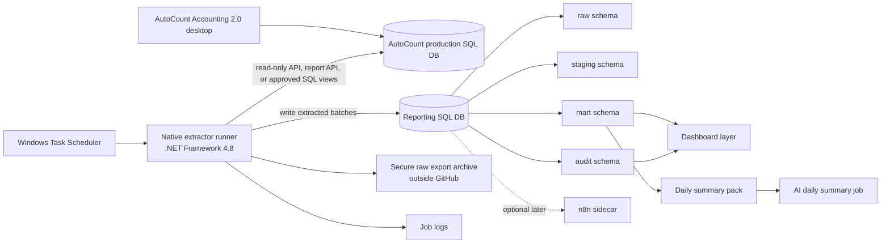

# AutoCount 2.0 Local Automation Architecture

This design assumes AutoCount Accounting 2.0 and Microsoft SQL Server 2019 run on the same existing Windows VM. It optimizes for low/no additional cost, read-only automation first, and a native Windows approach.

## Architecture Goals

- Keep AutoCount production tables protected.
- Avoid direct SQL writes to AutoCount.
- Run locally on the existing Windows VM.
- Use Windows Task Scheduler instead of paid orchestration.
- Load a separate reporting/analytics database on the same SQL Server instance.
- Feed dashboards and AI summaries only from curated reporting views.
- Keep n8n optional for later notifications or approvals, not part of the first critical path.

## Logical Design



## Components

### AutoCount VM

Use the existing Windows VM as the execution boundary. Running the extractor beside AutoCount avoids firewall, file share, and remote SQL complications during the spike.

Required local software:

- AutoCount Accounting 2.0 client/server components.
- Microsoft SQL Server 2019.
- .NET Framework 4.8 runtime.
- Extractor runtime folder outside the repo, for example `D:\XBoundaries\AutoCountAutomation`.
- Secure archive folder outside the repo, for example `D:\XBoundaries\AutoCountArchive`.

### Native Extractor Runner

Preferred implementation: .NET Framework 4.8 console application.

Responsibilities:

- Open a read-only AutoCount API/session or read approved read-only SQL views.
- Extract only configured datasets.
- Write raw batch files and reporting database rows.
- Record run status, row counts, checksums, warnings, and exceptions.
- Never write to AutoCount production tables.

First datasets:

- item master and product attributes,
- stock status/balance/cost by item/location,
- debtor and creditor master,
- sales invoice and cash sale listings,
- purchase order and GRN listings,
- AR/AP open item summaries,
- account and GL summary data if approved.

### Windows Task Scheduler

Use Task Scheduler for the first version because it is built into Windows and enough for daily read jobs.

Suggested schedules:

- `02:00` daily extraction after business close.
- `02:30` validation and mart refresh.
- `03:00` dashboard snapshot generation.
- `03:15` AI summary pack generation.

Each task should run under a dedicated Windows service account with minimal local permissions.

### Reporting SQL Database

Create a separate database, for example `XB_AutoCount_Reporting`, on SQL Server 2019. The extractor writes here only. AutoCount writes here never.

Schemas:

- `raw`: append-only ingested rows by source and batch. Keep source field names and raw payload hashes.
- `stg`: typed, cleaned staging tables with consistent dates, amounts, item codes, account codes, and location codes.
- `mart`: curated business-facing tables/views for dashboards and AI packs.
- `audit`: run manifests, row counts, source checksums, data quality checks, exceptions, and approval logs.

Optional later schemas:

- `ref`: internal SKU mappings and approved business mappings.
- `queue`: future write-back request queue, only after the read side is stable.

### Raw Export Archive

Keep raw CSV/JSON extracts outside GitHub. Each batch should have a deterministic folder:

```text
D:\XBoundaries\AutoCountArchive\
  2026-06-06\
    run_manifest.json
    item_master.csv
    stock_status.csv
    sales_invoice_listing.csv
    ar_open_items.csv
```

Retention recommendation:

- Keep daily raw extracts for 90 days.
- Keep month-end snapshots for 7 years if finance requests it and storage is approved.
- Store hashes in `audit.extract_file`.

### Dashboard Layer

Lowest-cost options:

1. Power BI Desktop connected to `mart` views. Good first choice if business users already use Power BI locally. Scheduled cloud refresh may require additional licensing.
2. Static HTML/Markdown dashboard generated by scheduled script. Good for zero license cost and GitHub-style review.
3. SQL Server Reporting Services only if already licensed/installed.
4. Metabase or another open-source BI sidecar later if the team is comfortable operating a service.

Initial dashboard views:

- daily sales by channel/outlet,
- stock on hand by item/location,
- low-stock and dead-stock candidates,
- product master completeness,
- open AR/AP aging summary,
- extraction health and data quality warnings.

### AI Daily Summary Layer

The AI layer must read a generated summary pack, not unrestricted ERP data. The pack should be a small JSON or Markdown file generated from curated `mart` views.

Example pack contents:

- total sales, gross margin if approved, and transaction count,
- top movers and slow movers,
- stockouts and low-stock risks,
- unusual AR/AP changes,
- failed extraction or data quality checks,
- links to dashboard tables for human review.

Provider choices:

- Local LLM through Ollama or a similar local runtime if the VM has enough resources.
- Low-cost hosted API only if secrets can be stored outside the repo and the curated pack is approved for external processing.

AI output should be advisory. It should never post transactions, update master data, or send unrestricted raw rows to a model.

### Optional n8n Sidecar

n8n is optional and should not be introduced unless it clearly saves effort.

Useful later roles:

- send daily summaries to email/chat,
- route exception approvals,
- watch for generated summary files,
- orchestrate human approval for future write-back queues.

Avoid using n8n as the database of record. It should receive manifests, dashboard links, or curated summary packs, not raw ERP data.

## Data Flow

1. Task Scheduler starts the extractor.
2. Extractor opens a read-only source connection.
3. Extractor writes raw files outside GitHub.
4. Extractor loads `raw` tables in the reporting DB.
5. Stored procedures or extractor steps transform `raw` to `stg`.
6. Mart refresh creates dashboard-ready views.
7. Validation checks write to `audit`.
8. Dashboard refresh reads `mart` and `audit`.
9. AI job reads a generated summary pack from `mart` views.

## Security Boundary

Use two distinct data access identities:

- AutoCount source read identity: `SELECT` only on approved views, or API user with read-only access where supported.
- Reporting loader identity: write access to `XB_AutoCount_Reporting` only.

Do not grant the reporting loader account permissions on AutoCount production tables.

## First Technical Spike

Build a tiny extractor proof of life:

- Connect to the account book using a test company or non-production copy if available.
- Extract one low-risk dataset, such as item master or debtor listing.
- Write rows to `raw.item_master` and `audit.extract_run`.
- Generate a single `mart.vw_item_master_quality` view.
- Produce a one-page dashboard or Markdown summary.

Exit gate: the read-only account cannot insert, update, delete, execute posting routines, or alter AutoCount schema.
