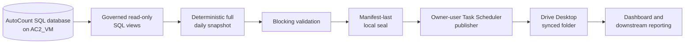
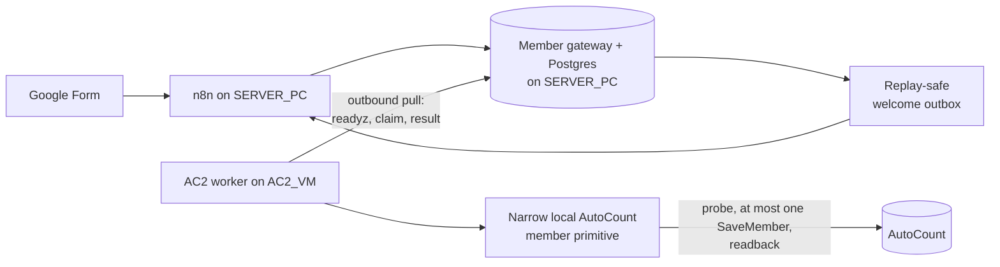

# AutoCount 2.0 Automation Architecture

Canonical architecture surface for the AutoCount 2.0 automation work in this
repository (#155). It records the accepted target architecture for the two
current lanes and the status of each.

```text
ARCHITECTURE_AUTHORITY=#155 G1-147 (Web acceptance #155:5889718018)
MEMBER_WRITE_CONTRACT=W-G2-149 (+ Web amendment #155:5890550314)
REPORTING_CONTRACT=R-G2-148 (+ Web amendments #155:5890302647)
REPORTING_ARCHITECTURE_STATUS=ACCEPTED
REPORTING_IMPLEMENTATION_STATUS=QUEUED_NOT_YET_IMPLEMENTED
MEMBER_WRITE_ARCHITECTURE_STATUS=ACCEPTED
MEMBER_WRITE_IMPLEMENTATION_STATUS=REPOSITORY_IMPLEMENTATION_PRODUCTION_DARK
FIRST_PRODUCTION_MEMBER=SEPARATE_W-ACT_GATE (not authorised)
GENERIC_AUTOCOUNT_API_FACADE=DEFERRED_NOT_CURRENT
```

Logical host names only are used here: `AC2_VM` (the Windows VM running
AutoCount 2.0 and its SQL Server), `SERVER_PC` (the host running n8n and the
member gateway with its Postgres database), `gateway`, `worker`, `AutoCount`
and `Drive Desktop` (Google Drive for desktop). Private host, network, book,
database, credential and discovery details do not belong in this repository.

## Stable boundaries (both lanes)

- AutoCount remains the source of truth for accounting, inventory and member
  records. Nothing in this repository replaces it.
- No direct SQL writes to AutoCount, ever.
- Reporting reads go through governed, read-only SQL views. The member lane
  reads and writes only through the official AutoCount member API, inside one
  narrow local AutoCount primitive on `AC2_VM`. There is no other write path.
- Credentials, private configuration and generated outputs stay outside
  GitHub.

## Reporting lane (accepted, implementation queued)

```text
REPORTING_ARCHITECTURE_STATUS=ACCEPTED
REPORTING_IMPLEMENTATION_STATUS=QUEUED_NOT_YET_IMPLEMENTED
```

The reporting exporter, validator, seal and publisher described below are not
yet implemented in this repository. The implementation lane (R-G3-150) is
queued. Until it lands, treat this section as the accepted target, not as a
description of shipped code.


```mermaid
flowchart LR
    AC[(AutoCount SQL database<br/>on AC2_VM)] --> V[Governed read-only<br/>SQL views]
    V --> S[Deterministic full<br/>daily snapshot]
    S --> Val[Blocking validation]
    Val --> Seal[Manifest-last<br/>local seal]
    Seal --> Pub[Owner-user Task Scheduler<br/>publisher]
    Pub --> DD[Drive Desktop<br/>synced folder]
    DD --> Dash[Dashboard and<br/>downstream reporting]
```

1. **Governed SQL views** are the admitted read boundary. The export identity
   has `SELECT` on the approved views only.
2. **Deterministic full daily snapshot.** Each run exports the complete
   admitted dataset set; there is no incremental change-capture in V1.
   Snapshot isolation is preferred. Where it is unavailable, the accepted
   fallback is a quiet-hour read with blocking cross-table invariants and one
   bounded retry.
3. **Blocking validation.** A snapshot that fails validation is never sealed
   or published.
4. **Manifest-last local seal.** Files are written first and the manifest is
   written last, so a partial snapshot can never look complete.
5. **Owner-user Task Scheduler publisher** copies only sealed snapshots into
   the **Drive Desktop** synced folder. Publication is idempotent.
6. **Dashboards and downstream reporting** consume sealed snapshot outputs
   only, never live AutoCount tables.

Disclosure limits (R-G2-148 amendments): a random opaque reporting-source ID
from private configuration identifies the source; any member identity used to
derive a keyed pseudonym is transient process input only; V1 exports
counterparty codes and non-personal attributes, not counterparty names.

Deferred or excluded:

- Marketplace settlement / payout economics is deferred to V2.
- Advanced MDSA (multidimensional sales analysis) is a consumer requirement,
  not the extraction engine.
- A freshness monitor is required before unattended reporting is considered
  operational, but it does not block the first validated snapshot.

## Member-write lane (accepted, implemented in repository, production-dark)

```text
MEMBER_WRITE_ARCHITECTURE_STATUS=ACCEPTED
MEMBER_WRITE_IMPLEMENTATION_STATUS=REPOSITORY_IMPLEMENTATION_PRODUCTION_DARK
FIRST_PRODUCTION_MEMBER=SEPARATE_W-ACT_GATE
```


```mermaid
flowchart LR
    GF[Google Form] --> N8N[n8n on SERVER_PC]
    N8N --> GW[(Member gateway + Postgres<br/>on SERVER_PC)]
    W[AC2 worker on AC2_VM] -->|outbound pull:<br/>readyz, claim, result| GW
    W --> P[Narrow local AutoCount<br/>member primitive]
    P -->|probe, at most one SaveMember,<br/>readback| AC[(AutoCount)]
    GW --> OB[Replay-safe<br/>welcome outbox]
    OB --> N8N
```

- **Google Form and n8n** own intake and orchestration. n8n ingests form
  responses into the gateway and later sends welcome emails from the outbox.
- **Gateway and Postgres on `SERVER_PC`** own the durable queue and state:
  responseId + payload-hash idempotency, the job state machine, a single
  active lease across all jobs, retry budgets, the kill switch and activation
  flag, and the welcome-email outbox.
- **The worker on `AC2_VM` pulls work outbound.** Each cycle makes exactly
  three gateway calls: readiness, claim, result. Nothing connects inbound to
  `AC2_VM` or AutoCount.
- **AutoCount is changed only by the narrow local primitive.** Under a local
  machine-wide mutex it probes existing members, decides, calls `SaveMember`
  at most once per invocation, and reads the result back. An uncertain
  outcome is resolved by running the same job again: the next probe sees
  what actually happened.
- **Welcome email** uses a durable, replay-safe outbox. Only a verified new
  member (`CREATED_VERIFIED`) gets one; a linked, reviewed or rejected job
  never does, and an email whose delivery is uncertain is never resent.

MemberNo and identity rules (XB-MN-1):

- The base MemberNo is the submitted phone after the existing ingest clean-up,
  digits only. There is no country inference and no E.164 conversion. Leading
  zeroes are kept, and a base starting `000` is an ordinary base.
- There is no automatic X1/X2/X3 suffix allocation.
- An obvious existing member - a member already holding the number (or an
  unambiguous format variant of it) with the same email, or the same name
  ignoring word order - links to the existing record (`LINKED_EXISTING`);
  nothing is created and no existing record is updated. An email that only
  matches a member with a different number does not link; it is recorded as a
  data-quality flag.
- A genuine shared number belonging to a different person gets the base plus
  a bounded name component (ASCII letters from the name, total length at
  most 20).
- Inactive, multiple, unknown or conflicting evidence, a name-component
  collision, or an empty name component goes to `MANUAL_REVIEW`.

Test safety: synthetic test operations require explicit test-book mode, an
allowlisted test book, synthetic name and email markers, guarded test hooks
and pre-test absence checks. Synthetic markers are refused in production.

Contract and runbooks:

- [Member gateway production contract](member_gateway_production_contract.md)
- [Member gateway production runbook](member_gateway_production_runbook.md)
- [Member write v2 live runbook](member_write_v2_live_runbook.md)
- [Member intake automation blueprint](member_intake_automation_blueprint.md)

The code is production-dark: the kill switch is on, activation is off, the
worker task is disabled and n8n workflows are inactive. Every live step, and
the first production member (W-ACT), needs its own approval.

## Deferred / not current

- A generic X-Boundaries AutoCount API wrapper, external-agency API product,
  client administration UI or broad endpoint catalogue is deferred by the
  Owner and is not a design requirement.
- AutoCount write-back other than member creation (for example purchasing or
  accounting postings) is not in scope.
- CoA, GL opening, bank opening and full accounting cutover remain parked; see
  the [inventory intelligence scope](inventory_intelligence_scope.md).

## Superseded architecture (historical)

The earlier design in this file (a .NET Framework extractor loading a
separate reporting SQL database with raw/staging/mart/audit schemas, feeding
dashboards and an AI summary pack, with n8n as an optional sidecar) is
superseded as the target architecture. Existing read-only extraction and
probe scripts and their runbooks remain as evidence tooling; they are not the
target pipeline. See the historical [MVP plan](mvp_plan.md).

The earlier member designs (Google Sheets queue, local lookup bridge, dry-run
flow, and the gateway's X1/X2 allocator with dispatch fence and writer
registration/quarantine) are also superseded; see the
[member intake automation blueprint](member_intake_automation_blueprint.md).
